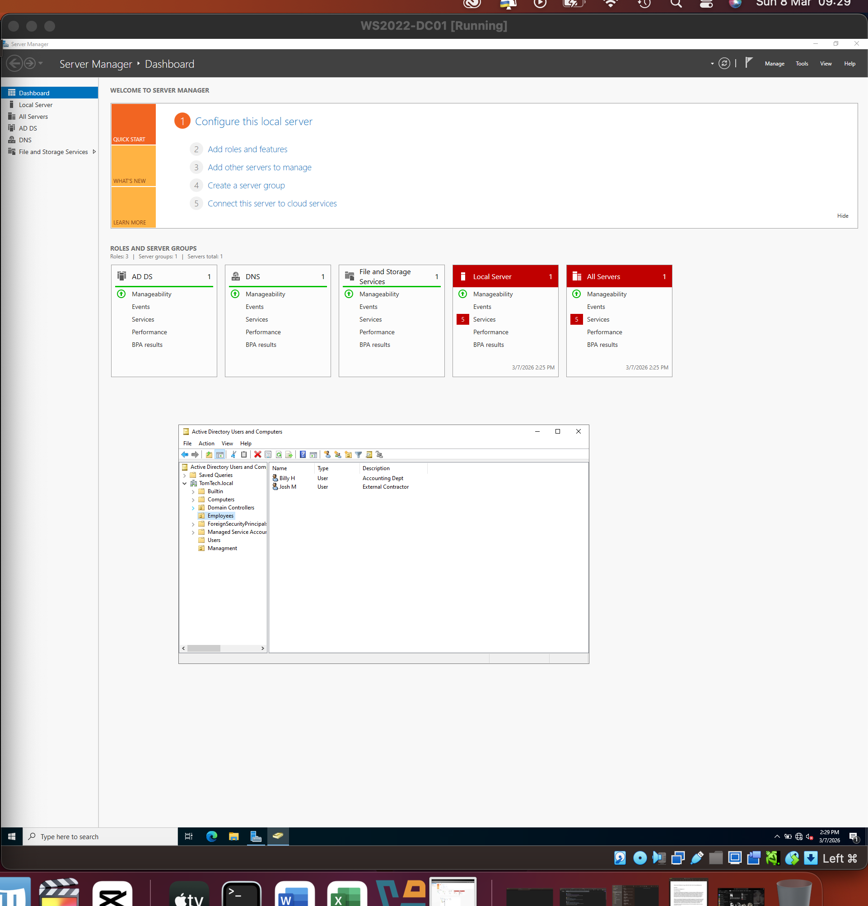
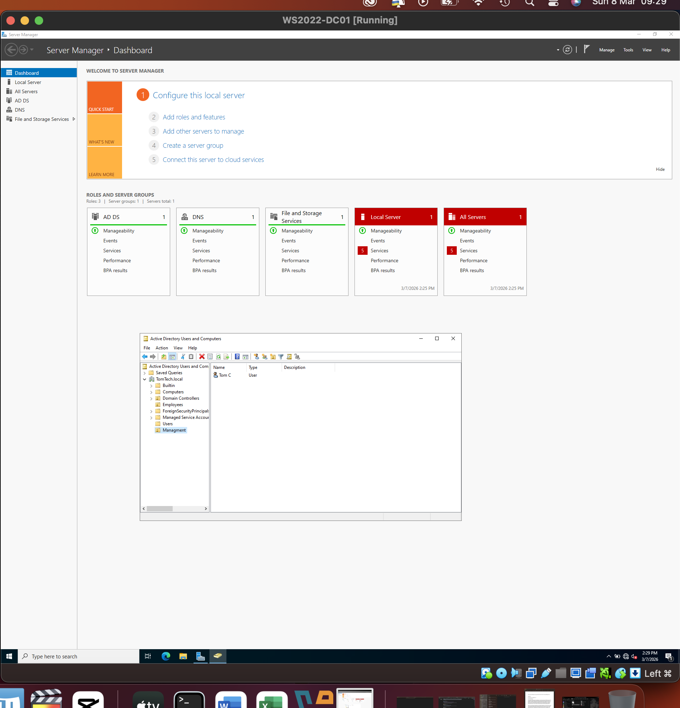

# Home-Labs
Documentation and logs for my Windows Server 2022 and CompTIA A+ lab environments.
# Executive Summary 
This project demonstrates the deployment and configuration of a Windows Server 2022 environment to manage network identities and security. By moving away from local account management, this lab establishes a centralized authority (Domain Controller) to govern user access and security policies, simulating a professional enterprise network.
# Technical Environment
* **Hypervisor:** Oracle VM VirtualBox (Running on macOS).

* **Storage:** External SSD (ExFAT) to simulate high-capacity mobile lab environments.

* **Operating System:** Windows Server 2022 Standard (Desktop Experience).

* **Network Topology:** Static IPv4 configuration with localized DNS resolution.

# Lab Methodology 
Phase 1: Infrastructure Setup 

Static IP Configuration: Configured a persistent internal IP address to ensure reliable DNS and authentication services.

Role Deployment: Installed Active Directory Domain Services (AD DS) and promoted the server to a Forest Root Domain (TomTech.local).

Phase 2: Directory Structure & User Provisioning

I implemented a structured Organizational Unit (OU) hierarchy to reflect a departmental business model.

OU Hierarchy: Created Employees and Management containers to separate administrative and general staff roles.

User Lifecycle Management: Provisioned initial user accounts for staff members, including Billy H and Josh M, implementing "Change Password at Next Logon" security protocols.

# Cybersecurity & Troubleshooting Insights
The "Gateway" Challenge: Encountered a total loss of connectivity after manual IP assignment.

Resolution: Conducted a root-cause analysis using ipconfig /all. Identified a mismatch in the Default Gateway and corrected the entry to align with the VirtualBox NAT interface.

Security Best Practice: Used 127.0.0.1 (Loopback) as the Preferred DNS to ensure the Domain Controller manages its own name resolution, a critical requirement for Active Directory health.

# Visual Proof 
 

## Day 2: Security Group Implementation
* **Task:** Created 'Management_Staff' and 'Operations_Staff' Security Groups.
* **Logic:** Implemented group-based access control (RBAC) to streamline identity management.
* **User Provisioning:** Assigned Billy Hoy and Josh Moore to the Operations group to prepare for file-level permission testing.

## Day 2: File Services & Access Control
* **Task:** Created a localized network share titled 'Operations_Data'.
* **Security Implementation:** Configured a dual-layer permission model (Share + NTFS).
* **Identity Logic:** Assigned permissions to the 'Operations_Staff' group to ensure scalable management of users Billy H and Josh M.
* **Troubleshooting:** Verified group membership inheritance to ensure seamless access.

## Day 3: Resource Procurement
* **Task:** Sourced official Windows 11 Pro (Multi-edition) ISO via Microsoft Software Download center.
* **Requirement:** Selected Pro edition to support Active Directory Domain Join capabilities.
* **Storage:** Staged installation media on external high-speed SSD to maintain host system performance.

* ## Troubleshooting: Virtual Machine Boot Failure
* **Issue:** Received 'No bootable medium found' error upon initial launch of WIN11-CL01.
* **Root Cause:** The virtual optical drive was empty; the system lacked an ISO image to initiate the OS installation.
* **Resolution:** Manually mounted the Windows 11 ISO to the virtual DVD drive and prioritized the boot sequence to 'Optical' in the VM settings.

* ## Lab Note: Licensing & Activation
* **Strategy:** Utilized 'Evaluation Mode' for Windows 11 Pro deployment.
* **Reasoning:** Maintained full administrative functionality (Domain Join, GPUpdate) without licensing overhead, adhering to home-lab best practices for cost-efficiency.
* **Security Status:** Verified that unactivated status does not impede critical security updates or OS-level hardening.

## Troubleshooting: Windows 11 OOBE Network Requirement
* **Challenge:** Windows 11 installation halted at the 'Network Connection' stage due to missing virtualized network drivers.
* **Workaround:** Executed the `OOBE\BYPASSNRO` command via elevated Command Prompt to bypass the mandatory internet requirement.
* **Resolution:** Provisioned a local administrative account and subsequently installed VirtualBox Guest Additions to provide the necessary virtual network interface drivers.

## Day 3: Bypassing Mandatory Cloud Integration
* **Status**: Successfully revealed the 'I don't have internet' bypass link.
* **Action**: Proceeding with 'Limited Setup' to provision a local administrative account.
* **Logic**: Ensuring environment isolation by avoiding Microsoft Account (MSA) linkage, a prerequisite for controlled domain environments.

## Day 3: Driver Integration & Performance Optimization
* **Task:** Installed VirtualBox Guest Additions on WIN11-CL01.
* **Outcome:** Resolved network adapter driver deficiency and enabled dynamic display scaling.
* **Configuration:** Enabled 'Bidirectional Shared Clipboard' to facilitate efficient administrative workflows between host (macOS) and guest (Windows 11).

## Day 3: DNS Configuration & Name Resolution
* **Task:** Manually configured IPv4 DNS settings on WIN11-CL01.
* **Logic:** Pointed the client's preferred DNS to the Domain Controller's static IP to enable Active Directory service location.
* **Validation:** Executed 'ping' commands against the 'LineUp.lab' FQDN to verify successful name-to-IP resolution.
* **Networking Status:** Confirmed internal virtual switch connectivity between Client and Server.

## Troubleshooting: DNS Name Resolution Failure
* **Issue:** Client unable to resolve 'TomTech.local' (Error: Ping request could not find host).
* **Investigation:** Conducted connectivity tests via IP to isolate the Physical vs. Application layer.
* **Root Cause:** [e.g., Mismatched Internal Network names in VirtualBox / Incorrect DNS entry on Client].
* **Resolution:** [e.g., Aligned virtual network adapters to 'LabNetwork' and enabled ICMPv4 Inbound rules on the Domain Controller].

## Day 3: Successful Domain Integration
* **Task:** Performed a Domain Join for workstation 'WIN11-CL01' into 'TomTech.local'.
* **Authentication:** Utilized Domain Admin credentials to authorize the computer object within Active Directory.
* **Validation:** Successfully authenticated as a standard user ('bhoy') to verify cross-system identity propagation.
* **Cybersecurity Insight:** Demonstrated the transition from local to centralized authentication, a core requirement for managing 'Least Privilege' at scale.

* ## Troubleshooting: Active Directory Domain Controller (AD DC) Unreachable
* **Issue**: Domain join failed with error "AD DC for the domain 'TomTech.local' could not be contacted" despite successful ICMP pings.
* **Root Cause Analysis**: Investigated DNS SRV record resolution and network profile status.
* **Attempted Resolution**: Configured explicit DNS Suffixes and verified the removal of external secondary DNS resolvers to ensure internal-only name resolution.
* **Status**: [Update this once you get the 'Welcome' message!]

* ## Infrastructure Audit: Server-Side Networking
* **Verification:** Confirmed static IPv4 assignment within Server Manager.
* **Security Profile:** Verified network interface is set to 'Private/Domain' to allow RPC and LDAP traffic.
* **Consistency Check:** Cross-referenced Server IP with Client DNS configuration to ensure alignment.

* ## Network Addressing Schema
* **Subnet:** 192.168.10.0/24
* **Domain Controller (DC01):** 192.168.10.1
* **Workstation (CL01):** 192.168.10.10
* **Gateway/DNS Logic:** Implemented an isolated internal network with the DC acting as the primary DNS resolver for the 192.168.10.x segment.

## Day 4: Domain Join & User Authentication
* **Task:** Successfully joined 'WIN11-CL01' to the 'TomTech.local' domain.
* **Network Validation:** Confirmed that static IP 192.168.10.10 and DNS settings are providing stable name resolution.
* **IAM Implementation:** Authenticated using standard user credentials (bhoy) to verify Active Directory propagation.
* **Security Observation:** Verified that 'User must change password at next logon' policy is functioning as intended on the client machine.

## Day 4: Enterprise Automation via Group Policy (GPO)
* **Objective:** Implement automated resource provisioning for the 'Operations' department.
* **Implementation:** Created a GPO to map the '\\DC01\Operations_Data' share to the 'Z:' drive for all users in the 'Employees' OU.
* **Technical Logic:** Utilized GPO Preferences with 'Replace' action to ensure drive persistence across user sessions.
* **Outcome:** Successfully verified drive mapping for user 'bh', demonstrating scalable infrastructure management.

* ## Day 4: Validation of Centralized Resource Provisioning
* **Success:** Verified that 'GPO_Map_Operations_Drive' successfully pushed the network share to the 'WIN11-CL01' endpoint.
* **Result:** User 'bh' (Billy H) automatically received the 'Z:' drive upon login without manual intervention.
* **Permission Audit:** Confirmed 'Modify' rights for the 'Operations_Staff' security group by successfully creating and editing test files within the mapped volume.
* **Scalability Note:** This configuration ensures that any new user added to the 'Employees' OU will automatically inherit this infrastructure, minimizing administrative overhead.

## Security Simulation: Brute Force Mitigation & Forensic Analysis
* **Scenario:** Simulated a password-guessing attack against user 'bh'.
* **Security Control:** Implemented a '3-strike' Account Lockout Policy via GPO.
* **Incident Response:** Verified the policy successfully triggered a lockout on the 4th unauthorized attempt.
* **Forensic Investigation:** Utilized Windows Event Viewer to identify 'Event ID 4740'. Confirmed the source machine (WIN11-CL01) and the timestamp of the breach.
* **Cybersecurity takeaway:** Demonstrated the ability to bridge the gap between policy configuration and post-incident log analysis.

## Day 5: Incident Response & Digital Forensics
* **Scenario:** Verified Account Lockout Policy against a simulated brute-force attack.
* **Forensic Tooling:** Utilized Windows Event Viewer to isolate Event ID 4740 (Account Lockout).
* **Evidence:** Confirmed 'bhoy' account was locked out via 'WIN11-CL01' at [Current Time].
* **Automation:** Executed a PowerShell 'Get-WinEvent' query to parse security logs for rapid incident identification.
* **Analysis:** This workflow proves the effectiveness of the '3-strike' policy and the ability to conduct root-cause analysis on authentication failures.
# Visual Proof 
  
